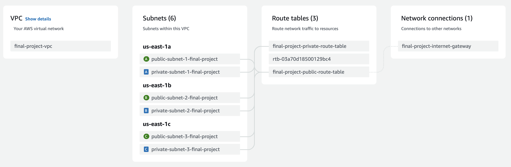

## About The Project

This VPC is designed to be deployed alongside and EKS cluster. It is configured to support a variety of applications that require both public and private subnets.  

### The key features are:
* VPC with unique CIDR 
  * "DNS Hostnames" enabled - required for EKS
* Three public subnets
  * Each subnet is in a different AZ for greater availability
  * Dynamically tagged to be used with EKS cluster
  * "Map Public IP on Launch" enabled to assign public IPs to the instances launched in this subnet
* Three private subnets 
  * Each subnet is in a different AZ for greater availability
  * Dynamically tagged to be used with EKS cluster
* Internet gateway
* Public and private route tables

## Getting Started

The VPC is deployed alongside the EKS cluster and apps in this repository using the GitHub Actions workflow located in the .github directory. See terraform-infra-23d-ubuntu/eks/README.md for installation instructions.

## Acknowledgments

* Amazon EKS VPC and subnet requirements and considerations: https://docs.aws.amazon.com/eks/latest/userguide/network_reqs.html
